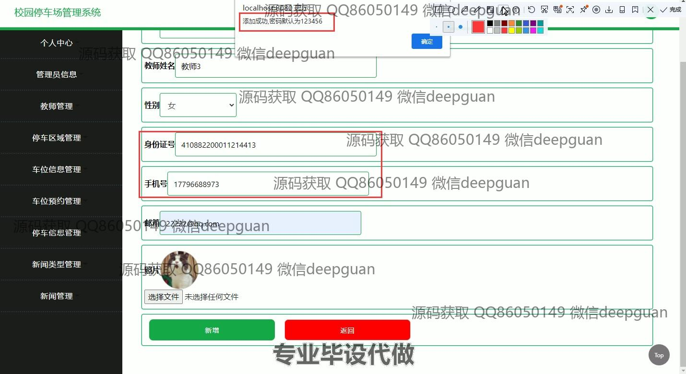

<h1 align="center">校园停车场管理系统</h1>

## 简介
校园停车场管理系统：角色分为管理员、教师；功能包括停车区域管理、车位信息管理、车位预约管理、车辆信息管理、停车信息管理和新闻管理，提供高效的校园停车资源管理和用户信息维护。    --计算机毕业设计源码；毕设源码；java毕业设计源码

## 联系方式

<h3 align="center">获取完整代码与数据库文件 + 微信：deepguan QQ: 86050149 QQ群: 783742310</h3>

<h3 align="center">可帮忙远程部署 包运行成功！提供远程部署、修改代码、设计文档指导、代码讲解等服务！</h3>

## 功能介绍（完整见运行截图）
管理员：基本功能包括登录、注册和退出。通过网站首页的主导航栏，管理员可以访问各种模块，如教师管理、停车区域管理、车位信息管理、车辆信息管理、车位预约管理、新闻管理等。在管理员信息管理中，管理员可以执行添加、查询和删除操作，管理平台各模块的访问权限。停车场管理涉及停车区域和车位管理，包括查看、查询、修改、删除区域和车位信息，以及车位预约和停车信息管理，通过筛选条件按需求处理数据，提升管理效率。

教师：教师可以通过登录后访问主界面，并管理与个人信息相关的操作，如查看和修改个人信息、预约停车位以及管理已预约的信息。在教师管理模块，教师的信息包括姓名、邮箱、手机号、身份证号等，可进行更新和维护。车位预约功能提供教师根据时间和区域进行停车位预约，查看预约状态并执行取消预约等操作。系统界面易于使用，便捷的预约和管理功能使教师能够轻松地规划停车安排。

用户（通用角色）：非管理员用户的核心功能为获取和管理停车位预约信息。用户可在网站首页通过导航栏访问停车区域、车位信息、车辆信息、预约状态等。停车位预约功能允许用户根据需求筛选可用车位并查看预约情况。在个人中心，用户可以查看和更新个人信息，包括账户安全修改。通过车位管理等模块，用户有效管理自身停车信息，确保顺利停车体验。

游客：游客可以浏览停车场管理系统界面，但功能上受到限制。未注册的游客可以查看系统主页和部分非交互性的模块，如新闻和公告类型。通过登录和注册选项，游客可转化为注册用户或教师后享受全功能服务。用户引导和界面设计简洁，内容划分合理，帮助游客快速了解平台功能，促进新用户的注册和使用。

## 运行截图

本代码来源于网络,仅供学习参考使用!

